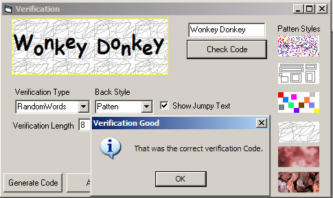



## DM Image Verification Example

### Description

hi Make this about 30 minutes ago, I was building a Chat Messager program and on the sign up from I wanted some sort of Verification Like you see in most webpages, so I came up with this idea, anyway the most of the code is in a class file and easy to use, You can Generate Random Uppercase, Lower case letters , Digits and also Define your own random words, and More anyway Hope you like it. Please vote if you find it usfull.
 
### More Info
 

             |
---                |---
**Submitted On**   |2006-05-07 09:51:10
**By**             |[dreamvb](https://github.com/Planet-Source-Code/PSCIndex/blob/master/ByAuthor/dreamvb.md)
**Level**          |Beginner
**User Rating**    |4.7 (14 globes from 3 users)
**Compatibility**  |VB 6\.0
**Category**       |[Graphics](https://github.com/Planet-Source-Code/PSCIndex/blob/master/ByCategory/graphics__1-46.md)
**World**          |[Visual Basic](https://github.com/Planet-Source-Code/PSCIndex/blob/master/ByWorld/visual-basic.md)
**Archive File**   |[DM\_Image\_V199267572006\.zip](https://github.com/Planet-Source-Code/dreamvb-dm-image-verification-example__1-65260/archive/master.zip)

